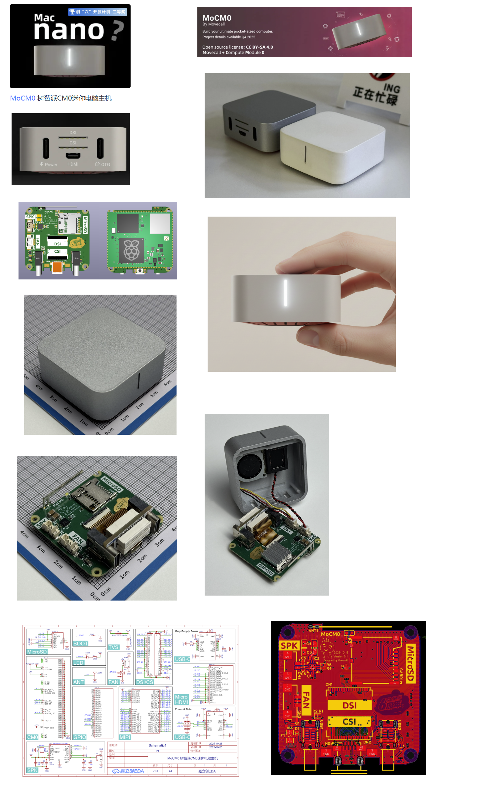
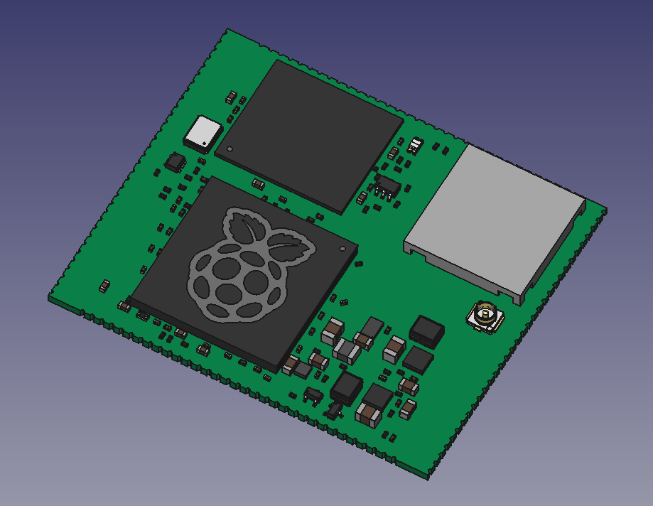

# Raspberry Pi Compute Module 0 (CM0) 3D Model (STEP)

## Description

This repository contains a 3D model of the Raspberry Pi Compute Module 0 (CM0) System-on-Module (SOM) in STEP format.

While designing hardware based on the Raspberry Pi CM0, I searched for an official 3D CAD model provided by Raspberry Pi. However, I was unable to find a STEP model for the CM0 on the manufacturer's website. Officially published 3D models are available for newer Compute Module generations such as CM3, CM4, and CM5, but not for the original CM0.

Because of this, I searched for alternative sources on the Internet to obtain a usable 3D representation of the module for mechanical integration and PCB design purposes.

## Source of the Model

The STEP model included in this repository was extracted from the following community project:

**MoCM0 (Raspberry Pi CM0 as a MAC Nano mini-computer)**

https://oshwhub.com/movecall/mocm0

The project is publicly available on the OSHW Lab platform.

Here is a quick preview of the MoCM0 project:

Here is a quick preview of the non-official Raspberry Pi CM0 3D model (STEP format):

## Extraction Process

The model was obtained through the following process:

1. Downloaded the project source files from OSHW Lab in EasyEDA format.
2. Opened the PCB CAD project files.
3. Extracted the embedded 3D model associated with the Raspberry Pi Compute Module 0.
4. Exported the model as a STEP file for use in mechanical CAD software.

## Disclaimer

This is not an official Raspberry Pi Foundation CAD model.

The STEP file was extracted from a third-party community project and is provided for convenience. The model has not been verified against official mechanical drawings and should be independently validated before being used in production designs.

## Purpose

The model can be used for:

- PCB design of the custom carrier board
- General Raspberry Pi CM0 hardware development
- PCB assembly visualization
- Mechanical enclosure design

## References

- Raspberry Pi Compute Module documentation: https://www.raspberrypi.com/documentation/computers/compute-module.html
- MoCM0 project: https://oshwhub.com/movecall/mocm0
- OSHW Lab: https://oshwhub.com

## Additional Notes

I suspect that the OSHW Lab user **movecall** may be associated with **EDAtec**, as EDAtec is a Raspberry Pi design and manufacturing partner known for supplying official Raspberry Pi accessories such as Active Coolers and enclosures.

The movecall profile can be found here:

https://oshwhub.com/movecall

The **MoCM0** project was published in October 2025, which was very close to the initial public introduction of the Raspberry Pi Compute Module 0.

## Raspberry Pi Compute Module 0 Timeline

The Raspberry Pi Compute Module 0 (CM0) was first presented in September 2025 during the China International Industry Expo (CIIF) in Shanghai, China.

General worldwide availability followed around the transition from 2025 to 2026, when the module entered regular commercial distribution.

Given the publication date of the MoCM0 project and the apparent early access to CM0 hardware, it is possible that the project author had access to engineering samples or early production units before the module became widely available.
